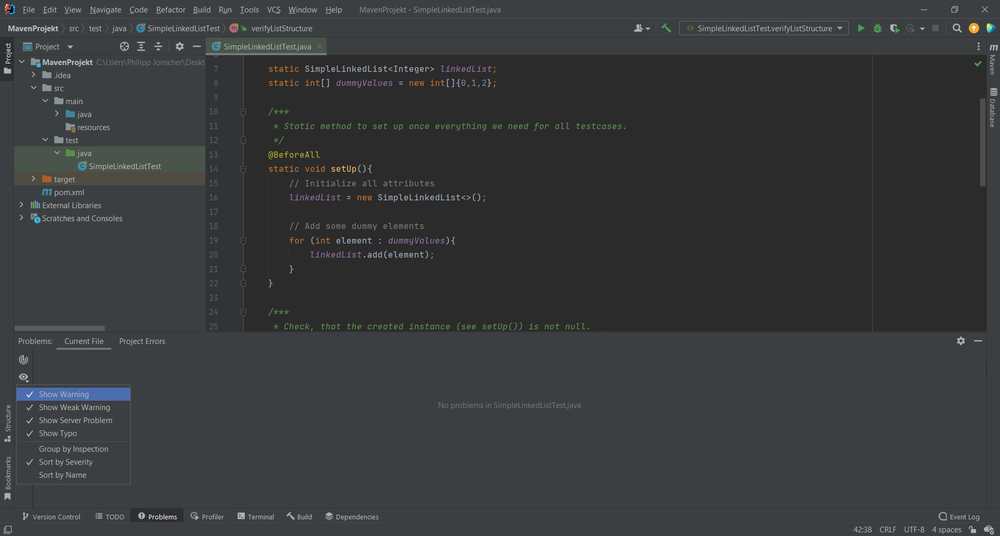
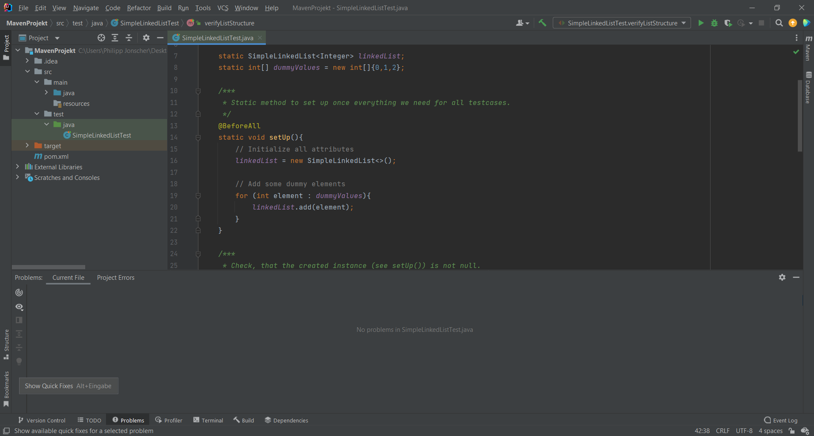

# Vorgehen zum Übungskomplex

## Aufgabe 3
Zunächst habe ich die Datei im LightMode geöffnet. Anschließend habe ich auf "Access full IDE" geklickt, dann 
über "New Project -> Maven -> Next" navigiert, Projektname & Pfad eingetragen und anschließend auf "Finish" geklickt.

### Anstoßen eines Kompilervorgangs mit Maven
```mvn compile```

### Anstoßen eines Testvorgangs mit Maven
```mvn test-compile```

## Aufgabe 4
Zunächst habe ich die POM-Datei um das Element _dependencies_ erweitert und anschließend dieses um 2 _dependency_ Elemente, 
für jUnit & AssertJ, erweitert. 

Zusammengefasst ergab sich diese Änderung/Erweiterung in der POM-Datei:
```
<dependencies>
  <dependency>
    <groupId>org.junit.jupiter</groupId>
    <artifactId>junit-jupiter-api</artifactId>
    <version>5.9.1</version>
    <scope>test</scope>
  </dependency>
  <dependency>
    <groupId>org.assertj</groupId>
    <artifactId>assertj-core</artifactId>
    <version>3.23.1</version>
    <scope>test</scope>
  </dependency>
</dependencies>
```

## Aufgabe 5
Zur Installation von Jacoco wurde folgendes Element zum _dependencies_ Element hinzugefügt:
```
<dependency>
  <groupId>org.jacoco</groupId>
  <artifactId>jacoco-maven-plugin</artifactId>
  <version>0.8.8</version>
</dependency>
```
Warum kein EclEmma? EclEmma ist nur für Eclipse, während JaCoCo (basierend auf EclEmma) für jede Java-VM basierte Umgebung zugänglich ist (siehe [hier](https://www.jacoco.org/jacoco/trunk/doc/mission.html) und [hier](https://www.jacoco.org/jacoco/trunk/doc/integrations.html)).

### Arten der Abdeckung (siehe [hier](https://www.michael-albrecht.de/tdd/jacoco/) für genaueres)
* Instruktionen/Anweisungen (C0 Coverage)
* Branches (C1 Coverage)
* Codezeilen/Lines, Methoden
* Typen
* Zyklomatische Komplexität.

### Konfiguration
Erweiterung der Jacoco Dependency um folgendes Element:
```
<configuration>
  <argLine>@{argLine} -your -extra -arguments</argLine>
</configuration>
```
Hierbei handelt es sich um den allgemeinen Syntax. Alle möglichen Argumente können [hier]([https://link-url-here.org](https://www.eclemma.org/jacoco/trunk/doc/prepare-agent-mojo.html)) gefunden werden.

Anschließend (in IntelliJ) zu "Run -> Edit Configurations" navigieren und eine neue Konfiguration erstellen. Dazu auf "+" klicken, _jUnit_ auswählen und JaCoCo als Coverage-Runner auswählen (_Modify Options -> Specify alternative coverage runner_). Die Konfiguration von JaCoCo kann außerdem über das gleiche Fenster (_Modify_) erfolgen.

## Aufgabe 6
1. Neue Klasse, unter _src -> test -> java_ erstellt
2. jUnit in diese Datei importieren:
```
import junit.framework.Assert;
import org.junit.jupiter.api.*;
```
3. Testfälle entwickelt sowie Fehler behoben

### Behobene Fehler

* #### Zeile 35:
```
if (end != null); {end.next = e;}
```
geändert zu
```
if (end != null) {end.next = e;}
```

* #### Zeile 68
```
public E next() {
   current = current.next;
   return current.elem;
}
```
geändert zu
```
public E next() {
   Elem last = current;
   current = current.next;
   return last.elem;
}
```

## Aufgabe 7

Um die Warnungen im Compiler (bei IntelliJ) zu aktivieren:

_(Standardmäßig sollte dies, bei IntelliJ, aktiviert sein)_

Zur Installation von SpotBugs, wie bereits oben beschrieben, folgendes zur _pom.xml_ hinzufügen:
```
<reporting>
   <plugins>
      <plugin>
         <groupId>com.github.spotbugs</groupId>
         <artifactId>spotbugs-maven-plugin</artifactId>
         <version>4.7.3.0</version>
      </plugin>
   </plugins>
</reporting>
```

### Nach Ausführung von SpotBugs:
ToDo!

### Zusatz:
Übrigens, um die Warnungen/Errors/etc. zu beseitigen, gibt es in IntelliJ die Option _Show Quick Fixes_:

_(Das Menu erscheint bei dem Glühbirnen-Icon)_
